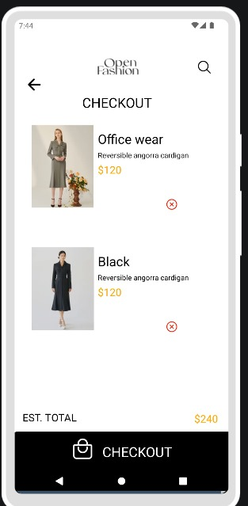
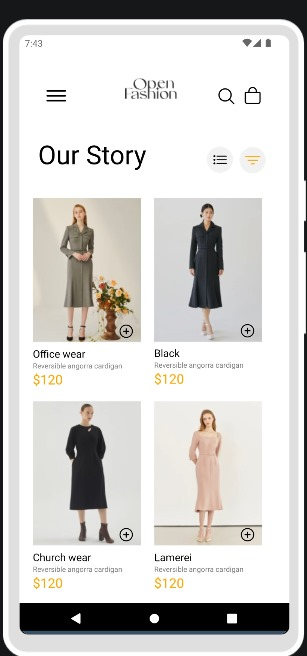

# rn-assignment6-11124414
## STUDENT ID: 11124414

## :star: Welcome To My E-commerce Mobile Application :star:
 ### Screenshots Of My E-commerce Mobile Application :star:

 

 ## Here Is A Brief Description Of How Each Component Works :fire:

 This mobile application was built using Visual Studio, Expo, and React Native to present a robust and efficient solution for building a seamless dress shopping experience. Visual Studio serves as the primary development environment, providing features like code completion, debugging, and project management. Expo, a framework for building cross-platform mobile applications with React Native, simplifies the development process by offering a pre-configured environment and features like push notifications, authentication, and analytics. React Native, a framework for building native mobile applications using JavaScript and React
### The application uses a simple and intuitive design, with a focus on showcasing dresses and making it easy for users to find what they're looking for.

 # 1. HomeScreen
    - This screen displays a list of available dresses in Open Fashion platform,eg Office wear clothings,Church wear clothings and it shows you the colours available to including images, prices, and details of dress.
    - Users can browse through the list, filter by categories and sort by price or popularity.
    - Each dress listing includes an "Add to Cart" button.

# 2. CartScreen 
    - This screen displays a list of dresses added to the cart, including quantities and subtotal prices.
    - Users can edit quantities, remove dresses, or apply promo codes.
    - A "Checkout" button leads to the payment process.

# 3. Add to cart button for each product:
    - When a user clicks the "Add to Cart" button, the dress is added to their cart.
    - The button updates to display the quantity added 

# 4. Remove from cart button for each selected item:
    - On the CartScreen, each dress listing includes a "Remove" button.
    - When clicked, the dress is removed from the cart, and the subtotal is updated

 ## How Data Storage Is Implemented

     This E-commerce Mobile Application uses asyncStorage which is a built-in React Native module and  allows you to store and retrieve data in a persistent manner. Here's a brief overview of how you can use AsyncStorage in your e-commerce application:

     - In storing data we use the setItem method to store data in AsyncStorage. For example, to store a user's cart contents:

AsyncStorage.setItem('cart', JSON.stringify(cartItems));

- In retrieving data we use the getItem method to retrieve data from AsyncStorage. For example, to retrieve a user's cart contents:

AsyncStorage.getItem('cart').then((cartData) => {
  const cartItems = JSON.parse(cartData);

});

-In removing data we use the removeItem method to remove data from AsyncStorage. For example, to remove a user's cart contents:

AsyncStorage.removeItem('cart');
 
